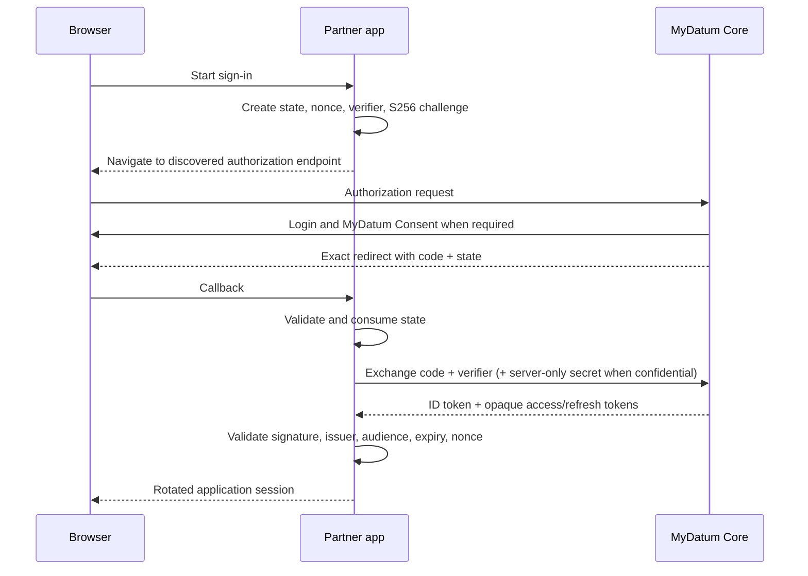

# Partner OAuth Authorization Code + PKCE Quickstart

Use this sequence after provisioning an application in Partner. The reusable PKCE/state fixtures live in [`fixtures`](../fixtures/).

Choose a runnable, dependency-pinned reference: [Node/Express](../starters/express/README.md) for confidential JavaScript servers, [React](../starters/react/README.md) for low-risk public browser clients, [Django](../starters/django/README.md) for confidential Python servers, or [React + TypeScript + Django](../starters/react-typescript-django/README.md) for a confidential full-stack application. Review the [authoritative contract](integration-contract.md), [error guidance](error-guidance.md), and [production checklist](production-checklist.md) before launch.

## Public and confidential flow



## 1. Discover configuration

Fetch `${MYDATUM_ISSUER}/.well-known/openid-configuration` on the trusted server or through a maintained OIDC library. Require the returned issuer to exactly equal configuration. Use its authorization, token, UserInfo, and JWKS endpoints.

Public browser clients must have their exact browser origin reviewed and registered in Partner.
MyDatum returns non-credentialed CORS headers on discovery, JWKS, token, and UserInfo only for an
enabled origin. The authorization endpoint is reached through browser navigation and does not require
CORS. Confidential server clients perform these requests server-side.

## 2. Create a transaction

Generate state, nonce, and a 43-128 character PKCE verifier with a cryptographically secure random source. Create the S256 challenge. Store the transaction for no more than ten minutes and mark it single-use.

The following is pseudocode aligned with the tested fixture in
[`fixtures/pkce.mjs`](../fixtures/pkce.mjs); use a runnable reference in production.

```js
const transaction = await createAuthorizationTransaction({
  authorizationEndpoint: metadata.authorization_endpoint,
  clientId: config.clientId,
  redirectUri: config.redirectUri,
  scopes: ['openid'],
})
// Persist transaction server-side or in short-lived sessionStorage for a public browser client.
window.location.assign(transaction.url) // browser navigation, never fetch()
```

## 3. Validate the callback

Handle `error` and `error_description` as untrusted display input. Before token exchange, require a matching state with bounded age and consume the transaction. Reject missing/mismatched state, missing code, expiry, and replay. Remove callback query parameters after processing.

## 4. Exchange the code

POST `application/x-www-form-urlencoded` to the discovered token endpoint with authorization code, exact redirect URI, client ID, and original verifier. A confidential client adds its secret only from its trusted server. Do not retry a one-time code after an uncertain exchange; start a fresh authorization.

## 5. Validate and establish the app session

Use a maintained OIDC library and discovered JWKS. Pin allowed algorithms and validate signature, issuer, audience, expiry, and nonce. Store issuer + opaque pairwise `sub` as the external identity key. Rotate the app session after login. OAuth tokens remain server-side for confidential applications and in memory for browser clients.

For `openid`, reject unexpected email, profile, phone, country, or roles claims. Optional claims may be absent even when requested. If calling UserInfo, require its `sub` to match the ID token.

## Logout and cleanup

Clear the local application session and server-held tokens. MyDatum does not currently advertise an end-session/revocation endpoint. Remove expired/used transactions and never log OAuth artifacts.

## Support and compatibility

Reference dependencies are pinned in their manifests and lockfiles. They are examples, not a hosted SDK or long-term compatibility promise. Run each sample's documented install, lint, test, build/start, and security checks when changing a dependency. MyDatum keeps advertised OAuth endpoint paths and error codes stable for v1, while human-readable error text and Partner UI routes may evolve. Include only the redacted request ID when requesting support.
